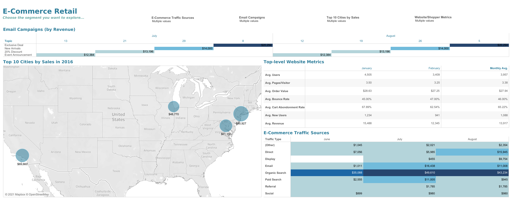
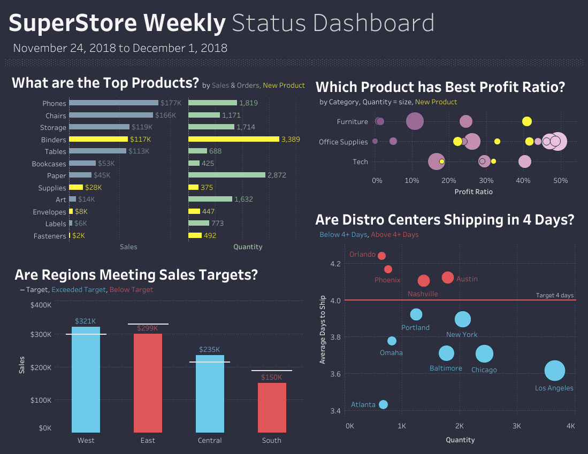

# Portfolio Projects
## Following are my projects in SQL, Python, Tableau & Excel:  
#### *You can also take a look at my Linkedin : *  

- [x] **SQL & Tableau** - 
  - Instagram Clone Data Analysis Project 
*See on Tableau Public:* **[Dashboard](https://public.tableau.com/views/InstagramCloneDataAnalysisDashboard/InstagramCloneDataAnalysisDashboard?:language=en-US&:display_count=n&:origin=viz_share_link)** 
*Review the Data Insertion SQL Script:* **[HERE]** 
*Review the Data Exploration SQL Script:* **[HERE]** 

- [x] **Hadoop (Hive)** - 
  - NYC Yellow Taxi Records: Data Analysis  
*Review the HiveQL Script:* **[HERE]** 

- [x] **SQL** - 
  - Nashville Housing Dataset: Data Cleaning  
*Review the SQL Script:* **[HERE]** 

  - COVID-19 Dataset: Data Exploration   
*Review the SQL Script:* **[HERE]** 

- [x] **PostgreSQL** - 
  - Business Intelligence Challenge  
*Review the PostgreSQL Script:* **[HERE]** 
*Review the Google Slides Deck to see the Data Visualizations:* **[HERE]** 

- [x] **Python** - 
  - Movies Industry Dataset: Exploratory Data Analysis Project  
*Read the complete Project Analysis in Markdown:* **[HERE]** 

- [x] **Tableau** - 

*To view these Tableau Dashboards in Tableau Public, click on the hypertext link.*

- #MakeoverMonday 2020 Week 32 | Benefits of Working from Home: https://public.tableau.com/views/MakeoverMonday2020Week32BenefitsofWorkingfromHome/WORKFROMHOME?:language=en-GB&:display_count=n&:origin=viz_share_link

  

- Municipality Data Analysis Dashboard: https://public.tableau.com/views/MunicipalityDashboard/Municipality?:language=en-GB&:display_count=n&:origin=viz_share_link

  

- GROVER Junior Data Analyst Case Study Dashboard: https://public.tableau.com/views/GROVERJuniorDataAnalystCaseStudy/GroverDataAnalystDashboard?:language=en-GB&:display_count=n&:origin=viz_share_link

  

- Retail Pricing Analytics Dashboard:

- E-commerce Sales Dashboard:

- Sales SuperStore Deep Data Analysis (5 Dashboards):
      
      1 KPI Dashboard

      2 Top-Down Dashboard
      

      3 Q&A Dashboard
      

      4 Bottom-Up Dashboard
      

      5 Geo Chart
      

- World Bank CO2 Emissions Dashboard: https://public.tableau.com/views/WorldBankCo2Emissions_16149182681650/Dashboard1?:language=en-GB&:display_count=n&:origin=viz_share_link 

- London Bus Safety Dashboard: https://public.tableau.com/views/TableauCertificationCourse2/ChartsDashboard?:language=en-GB&:display_count=n&:origin=viz_share_link 

- [x] **Excel** - 

*Kindly download these Excel files from this repository and view them in Microsoft Excel.*

- Sales Superstore Sample: Sales Performance Dashboard  

- NetTRON Network Infrastructure Data : LOOKUP, INDEX, MATCH, SUMIFS  

- Shipping Data: Pivot Tables, Pivot Chart, Slicers  

- Project Costing Model Data: Scenario Manager, Solver (Data Modeling)

--------------------------------------------------------------------------------------------------------------------------------------------------------------------------------
