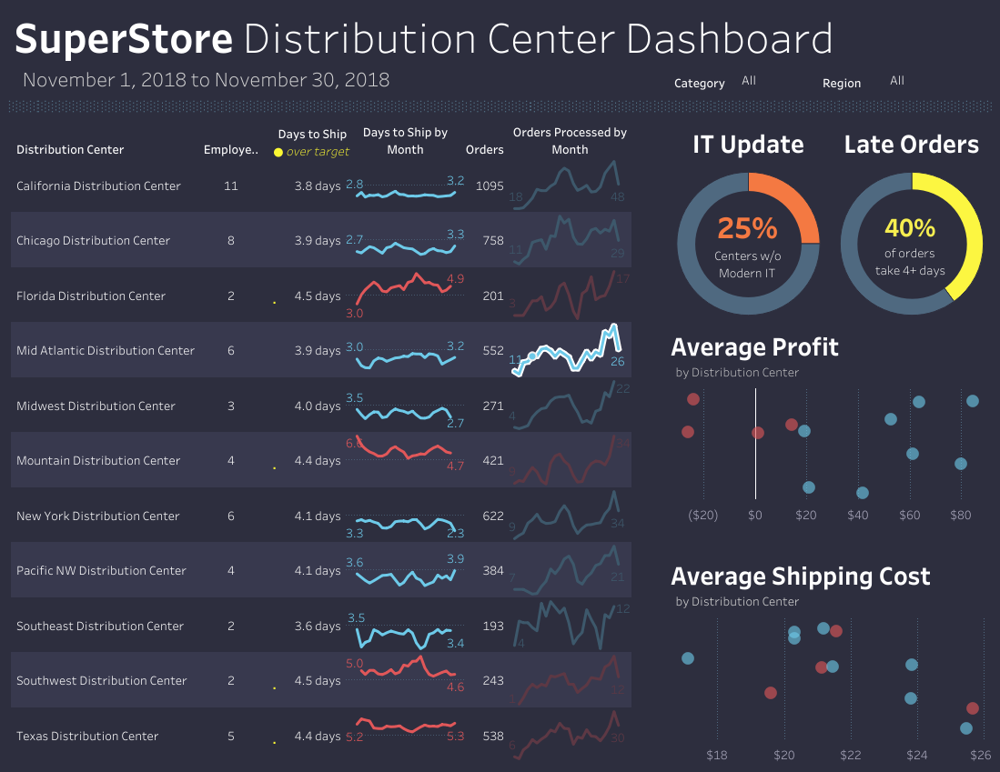

# Data Analyst Portfolio

Welcome to my Data Analysis Portfolio! This repository showcases a collection of projects that demonstrate my skills in data analysis, visualization, and business intelligence.

## 📂 Repository Structure

```
DataAnalystPortfolioProjects/
├── assets/
│   ├── docs/         # Project documentation
│   └── images/       # Project screenshots and visuals
├── projects/
│   ├── sql/
│   ├── python/
│   ├── tableau/
│   ├── hadoop/
│   ├── excel/
├── index.html        # Portfolio website
├── styles.css        # Website styling
└── script.js         # Website functionality
```

## 🚀 Projects Overview

### SQL Projects
1. **Instagram Clone Analysis**
   - **Tools:** SQL, Tableau
   - **Description:** Comprehensive analysis of user behavior and engagement patterns.
   - **Dashboard:**
   - 

2. **Data Cleaning**
   - **Tools:** SQL
   - **Description:** Techniques for data cleaning and preparation.
   - 

### Python Projects
1. **Movie Industry Analysis**
   - **Tools:** Python, Pandas, Matplotlib
   - **Description:** Exploratory data analysis of the movie industry.
   - 

### Tableau Projects
1. **Municipality Data Analysis**
   - **Tools:** Tableau
   - **Description:** Interactive dashboard analyzing municipal data.
   - **Dashboard:**
   - 

2. **Sales SuperStore Analysis**
   - **Tools:** Tableau
   - **Description:** Comprehensive analysis with 5 interactive dashboards.
   - 

### Hadoop Projects
1. **NYC Yellow Taxi Analysis**
   - **Tools:** Hadoop, Hive
   - **Description:** Large-scale analysis of NYC taxi data.
   - 

### Excel Projects
1. **Sales Performance Dashboard**
   - **Tools:** Excel
   - **Description:** Interactive dashboard analyzing sales performance.
   - 
   - **Excel Sheet:** [Download](projects/excel/sales_dashboard/SalesPerformance.xlsx)

2. **Advanced Excel Functions**
   - **Tools:** Excel
   - **Description:** Implementation of LOOKUP, INDEX, MATCH, and SUMIFS functions.
   - 
   - **Excel Sheet:** [Download](projects/excel/lookup_examples/AdvancedFunctions.xlsx)

3. **Pivot Tables & Charts**
   - **Tools:** Excel
   - **Description:** Advanced pivot table analysis with slicers and dynamic charts.
   - 
   - **Excel Sheet:** [Download](projects/excel/pivot_tables/PivotTables.xlsx)

4. **Data Modeling & Scenario Analysis**
   - **Tools:** Excel
   - **Description:** Project costing model using Scenario Manager and Solver.
   - 
   - **Excel Sheet:** [Download](projects/excel/scenario_manager/DataModeling.xlsx)

## 🛠️ Tools & Technologies
- SQL (MySQL, PostgreSQL)
- Python (Pandas, Matplotlib, Seaborn)
- Tableau
- Hadoop & Hive
- Excel (Advanced functions, Pivot Tables, Power Query)
- Power BI
- DAX

## 📫 Contact Information
- Email: bvansal.vb@gmail.com
- GitHub: [vishalbansal28](https://github.com/vishalbansal28)

Feel free to explore the projects and reach out if you have any questions!
